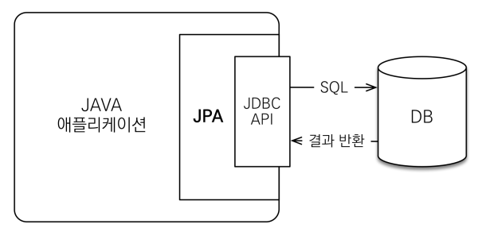
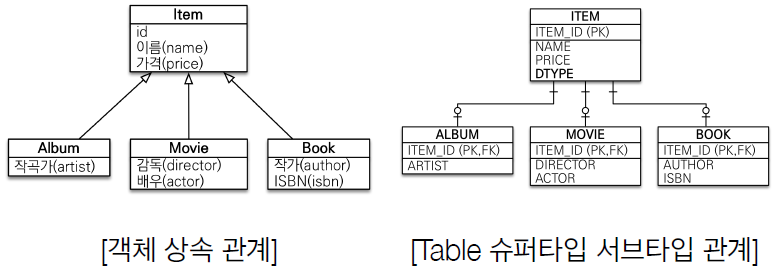
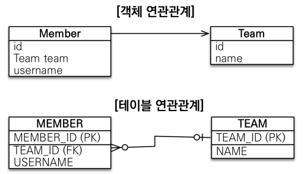

# JPA (Java Persistence API)
### 자바 진영 ORM 기술 표준

### ORM (Object-Relational Mapping)
- 객체와 관계형 데이터베이스를 매핑해주는 프래임워크
- 객체지향 패러다임을 유지할 수 있게 해줌
- JPA를 사용하려면 JPA를 구현한 ORM 프레임워크를 선택해야 함
  - 하이버네이트가 대표적

### 동작 방식

- 애플리케이션과 JDBC 사이에서 동작
- JPA 내부에서 JDBC API를 사용해 SQL을 호출해서 DB와 통신
- **개발자가 직접 JDBC API를 사용하지 않음**

### 사용 이유 (장점)
- 객체 중심의 개발 -> 생산성과 유지보수, 테스트 작성이 좋음
- 생산성 향상
  - SQL을 직접 작성하지 않고 데이터베이스 작업을 수행할 수 있어 개발 속도 향상
  - 코드의 가독성, 유지보수성 향상
- 데이터베이스 벤더 독립성
  - 다양한 데이터베이스를 지원, 데이터베이스 변경 시 코드 수정 최소화
  - 특정 구현 기술에 대한 의존도를 줄일 수 있고 다른 구현 기술로 손쉽게 이동할 수 있음
- 자동화된 데이터베이스 관리
  - 스키마 생성 및 업데이트, 데이터베이스 연결 관리 등을 자동으로 처리
  - 개발자가 비즈니스 로직에 집중할 수 있게 도와줌
- [패러다임의 불일치 해결](#패러다임-불일치)
- 성능
  - 1차 캐시와 동일성(identity) 보장
    1. 같은 트랜잭션 안에서는 같은 엔티티를 반환 → 약간의 조회 성능 향상
    2. DB Isolation Level이 Read Commit이어도 애플리케이션에서 Repeatable Read 보장
  - 트랜잭션을 지원하는 쓰기 지연(transactional write-behind)
    1. 트랜잭션을 커밋할 때까지 INSERT SQL을 모음
    2. JDBC BATCH SQL 기능을 사용해서 한번에 SQL 전송
    3. UPDATE, DELETE로 인한 로우(ROW)락 시간 최소화
    4. 트랜잭션 커밋 시 UPDATE, DELETE SQL 실행하고, 바로 커밋
  - 지연 로딩(Lazy Loading)
    - 지연 로딩: 객체가 실제 사용될 때 로딩
    - 즉시 로딩: JOIN SQL로 한번에 연관된 객체까지 미리 조회

## SQL 중심 개발과 비교

### SQL 중심 개발의 문제점
- 반복 코드 증가
- 강한 SQL 의존성
  - 필드 추가 시 DAO와 SQL의 대부분을 변경해야 함
  - 계층 분할이 어려움

### 패러다임 불일치
### 상속
- 객체는 상속 기능이 있지만 테이블은 없음
- DB 모델링에서 슈퍼타입 서브타입 관계를 사용하여 상속과 유사한 형태로 테이블 설계




- SQL
  ```sql
  -- 저장, ITEM과 ALBUM 데이터를 모두 저장해야 함
  INSERT INTO ITEM ...
  INSERT INTO ALBUM ...
  
  -- 조회
  -- 각각의 테이블에 따른 조인 SQL 작성..
  -- 각각의 객체 생성 등.. 복잡
  ```

- JPA
  ```java
  // 저장
  jap.persist(album);
  
  // 조회
  Album album = jpa.find(Album.class, albumId);
  ```
  


### 연관관계
- 객체는 참조를 사용해서 다른 객체와 연관관계를 가지고 참조에 접근
- 테이블은 외래 키를 사용해서 조인을 사용해서 연관 테이블을 조회



- SQL
```java
// 객체를 테이블에 맞춘 모델링
// 참조를 통해 연관 객체를 찾을 수 없음
class Member {
	String id;		// MEMBER_ID
	Long teamId;	// TEAM_ID FK
    String username;// USERNAME
}

class Team {
	Long id;		// TEAM_ID PK
	String name;	// NAME
}

// 조회 
public Member find(String memberId) {
    // SQL 실행
    Member member = new Member();
    // 데이터베이스에서 조회한 회원 관련 정보 입력
    Team team = new Team();
    // 데이터베이스에서 조회한 팀 관련 정보 입력
    
    // 회원과 팀 관계 설정
    member.setTeam(team);
    
    return member;
}
```

- JPA
```java
// 객체지향 모델링
class Member {
  String id;
  Team team;
  String username;
}
class Team {
  Long id;
  String name;
}

// 연관관계 저장
member.setTeam(team);
jpa.persist(member);
```

### 객체 그래프 탐색
- SQL
```java
// 엔티티 신뢰 문제

// SQL
SELECT M.*, T.*
  FROM MEMBER M
  JOIN TEAM T ON M.TEAM_ID = T.TEAM_ID
  
// 자바 코드
class MemberService {
    public void process() {
        Member member = memberDAO.find(memberId);
        member.getTeam(); // 사용 가능?
        member.getOrder().getDelivery(); // 사용 가능?
    }
}

// 계층 아키텍쳐에서는 이전 계층에서 넘어온 내용을 신뢰할 수 있어야 한다.
// 하지만 SQL에서 탐색된 객체 이외에는 사용할 수 없으므로 엔티티를 신뢰할 수 없다. 
// 모든 객체를 미리 로딩할 수 없음 -> 동일한 회원 조회 메서드를 여러 번 생성해야 함
```
- JPA
```java
Member member = jpa.find(Member.class, memberId);
Team team = member.getTeam();

// 신뢰할 수 있는 엔티티, 계층
class MemberService {
	public void process() {
		Member member = memberDAO.find(memberId);
		// 자유로운 객체 그래프 탐색 가능
		member.getTeam();
		member.getOrder().getDelivery();
	}
}
```

### 객체 비교
- SQL
```java
String memberId = "100";
Member member1 = memberDAO.getMember(memberId);
Member member2 = memberDAO.getMember(memberId);

// SQL 조회 후 새로운 객체를 반환하기 때문에 서로 다른 객체이다 
member1 == member2; // false
```

- JPA
```java
String memberId = "100”;
Member memberl = jpa.find(Member.class, memberld) ;
Member member2 = jpa.find (Member. class, memberld);

// JPA는 같은 트랜잭션안의 객체가 같음을 보장함
memberl == member2; // true
```

