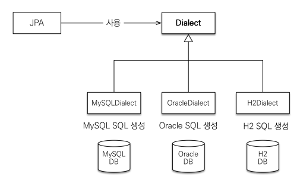

# JPA 시작

## 객체 매핑

### [Member 엔티티](start/src/main/java/jpabook/start/Member.java)
- @Entity
  - 테이블과 매핑되는 클래스임을 알려줌
  - 엔티티 클래스라고 함
- @Table
  - 매핑할 테이블 정보를 알려줌
  - 생략하면 클래스 이름을 테이블 이름으로 매핑
- @Id
  - 필드를 테이블의 기본 키와 매핑
  - 식별자 필드
- @Column
  - 필드를 컬럼에 매핑
  - 생략하면 필드명을 사용하여 컬럼명으로 매핑
    - 데이터베이스가 대소문자를 구분하지 않는 것으로 가정
    - 대소문자를 구분해야 하는 경우 명시적으로 매핑하는 것을 권장

## 설정

### 데이터베이서 방언 (Dialect)
- **SQL 표준을 지키지 않는 특정 데이터베이스만의 고유한 기능**
  - 각각의 데이터베이스가 제공하는 SQL 문법과 함수가 조금씩 다름
- JPA 구현체들은 이를 해결하기 위해 다양한 방언 클래스를 제공

## 애플리케이션 개발

### [JpaMain](start/src/main/java/jpabook/start/JpaMain.java)

### 엔티티 매니저 설정
- 엔티티 매니저 팩토리 생성
  - 생성 비용이 아주 크기 때문에 하나만 생성해서 전체 애플리케이션에서 공유해서 사용
- 엔티티 매니저 생성
  - JPA의 기능 대부분을 엔티티 매니저가 제공
  - 내부에 데이터소스(데이터베이스 커넥션)를 유지하면서 데이터베이스와 통신
  - 데이터베이스 커넥션과 밀접한 관계가 있으므로 스레드간에 공유하거나 재사용하면 안됨
- 종료
  - 사용이 끝난 엔티티 매니저는 close() 메서드로 반드시 종료해야 함
  - 애플리케이션 종료 시 엔티티 매니저 팩토리도 close() 메서드로 종료

### 트랜잭션 관리
- **JPA의 모든 데이터 변경은 트랜잭션 안에서 실행해야 함**
  - 트랜잭션 없이 데이터를 변경 시 예외 발생

### JPQL
> **식별자를 통한 단순 조회가 아닌 추가 조건들을 통해 조회**하고 싶을 때 사용
- SQL을 추상화한 객체지향 쿼리 언어
- **엔티티 객체를 대상**으로 쿼리
- SQL과 문법의 거의 유사
- DB를 바꾸더라도 방언을 교체할 필요 없음 = 특정 DB에 의존하지 않음
- 예) `select m from Member m`
  

