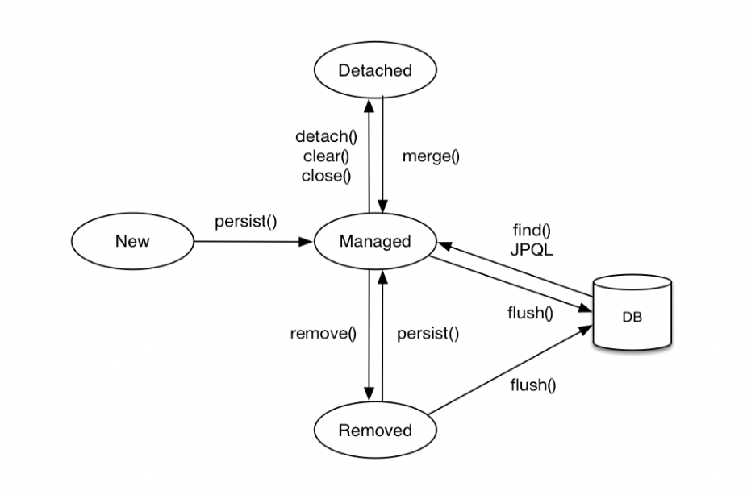

# 영속성

## 엔티티 매니저 팩토리 & 엔티티 매니저

### EntityManagerFactory
- 생성 비용이 큼
  - DB를 하나만 사용하는 애플리케이션은 일반적으로 하나만 생성
- 여러 스레드가 동시에 접근해도 안전, 서로 다른 스레드 간에 공유 가능

### EntityManager
- 엔티티를 저장하는 가상 DB
- 저장, 수정, 삭제, 조회 등 엔티티와 관련된 모든 일을 처리
- 동시성 문제가 발생하므로 스레드 간 공유 금지
- 엔티티 매니저는 DB 연결이 꼭 필요한 시점까지 커넥션을 얻지 않음
  - 보통 트랜잭션이 시작할 때 획득

## 영속성 컨텍스트 *
- 엔티티를 영구 저장하는 환경
- `em.persist(entity)` → 영속성 컨텍스트에 엔티티를 저장한다는 의미
- 논리적인 개념
- 엔티티 매니저를 생성할 때 만들어짐
  - 엔티티 매니저를 통해서 접근, 관리

## 엔티티 생명주기


### 비영속 (new/transient)
- 객체 생성, 초기화만 된 상태
- 영속성 컨텍스트나 DB와 관련 없음

```java
// 객체 생성 (비영속)
Member member = new Member();
member.setId("member1");
member.setUsername("회원1");
```

### 영속 (managed)
- 영속성 컨텍스트에 의해 관리되는 상태
- 엔티티 매니저를 통해 영속성 컨텍스트에 접근
- 영속 상태가 된다고 바로 DB에 쿼리가 날라가는 것은 아님
  - 커밋을 해야 실제 DB에 쿼리가 날라감

```java

EntityManager em = emf.createEntityManager();
em.getTransaction().begin();

// 객체 저장 -> 영속성 컨텍스트에 의해 관리됨 (영속)
em.persist(member);
```

### 준영속 (detached)
- 영속성 컨텍스트에 관리되다가 더 이상 관리되지 않는 상태
- **영속성 컨텍스트에서 삭제하는 것**

```java
em.detach(member);
```
- em.close(), em.clear()메서드를 호출해서 영속성 컨텍스트를 닫거나 초기화해도 준영속 상태가 된다.

### 삭제 (removed)
- 엔티티를 영속성 컨텍스트와 DB에서 삭제하는 것

```java
em.remove(member);
```

## 영속성 컨텍스트 특징
### 식별자
- 영속성 컨텍스트는 엔티티를 식별자로 구분 (@Id)
  - **영속 상태는 식별자 값 필수** 
  - 없으면 예외 발생
### DB 저장
- 보통 트랜잭션을 커밋하는 순간 영속성 컨텍스트에 새로 저장된 엔티티를 DB에 반영 
  - 플러시(flush)

## 영속성 컨텍스트 장점

### 조회
- 1차 캐시
  - 영속성 컨텍스트가 내부에 가지고 있는 캐시
  - 영속 상태 엔티티는 모두 1차 캐시에 저장
  ```java
  // 엔티티를 생성한 상태 (비영속)
  Member member = new Member();
  member.setId("member1");
  member.setUsername("회원1");
  
  // 엔티티를 영속 = 1차 캐시에 저장
  em.persist(member);
  
  //1차 캐시에서 조회
  Member findMember = em.find(Member.class, "member1");
  ``` 

  - 객체를 생성하고 `persist`하면 영속성 컨텍스트 내부의 1차 캐시에 저장
  - `key-value로` 저장
    - 키 = @Id로 매핑한 식별자
    - 값 = 엔티티 인스턴스

  - **`JPA`는 엔티티 조회할 때 1차 캐시부터 찾음**

- 엔티티가 1차 캐시에 없는 경우 DB에서 조회 후 1차 캐시에 저장 후 영속 상태의 엔티티 반환 

- 영속 엔티티의 동일성 보장
    ```java
    Member a = em.find(Member.class, "member1");
    Member b = em.find(Member.class, "member1");
    
    System.out.println(a == b);	// true
    ```
  - 1차 캐시는 항상 같은(동일한) 엔티티를 반환  
  - 1차 캐시로 반복 가능한 읽기(REPEATABLE READ) 등급의 트랜잭션 격리 수준을 **애플리케이션 차원**에서 제공

### 등록
**트랜잭션을 지원하는 쓰기 지연**
- 엔티티 매니저는 트랜잭션 커밋 전까지 내부 쿼리 저장소에 INSERT SQL문을 모아둠
- 이후 커밋이 실행되면 모아둔 쿼리를 DB에 전송 = flush
```java
EntityManager em = emf.createEntityManager();
EntityTransaction transaction = em.getTransaction();
//엔티티 매니저는 데이터 변경시 트랜잭션을 시작해야 한다.
transaction.begin(); // [트랜잭션] 시작

em.persist(memberA);
em.persist(memberB);
//여기까지 INSERT SQL을 DB에 보내지 않는다.
 
//커밋하는 순간 DB에 INSERT SQL을 보낸다.
transaction.commit(); // [트랜잭션] 커밋
```
- persist 메서드로 엔티티를 1차 캐시에 저장
- 동시에 해당 엔티티를 분석해서 INSERT SQL 생성 후 내부 SQL 저장소에 쌓아둠
- commit 시점에 내부 SQL 저장소에 저장된 SQL문을 한번에 DB에 보냄 

**쓰기 지연이 가능한 이유**
- SQL을 바로 바로 DB에 보내더라도 커밋하지 않으면 의미 없음
- 즉, 커밋 직전에만 DB에 SQL을 보내면 됨

**쓰기 지연을 사용하는 이유**
- 버퍼링 기능 쿼리를 여러 번 날리지 않고 최적화가 가능

### 수정
**변경 감지 (Dirty Checking)**
- 영속 컨텍스트에 엔티티 저장 시 최초 상태를 복사해서 1차 캐시에 저장 **(스냅샷)**
- 커밋 시 엔티티와 스냅샷을 비교해서 변경 데이터를 감지한다. **(변경 감지)**
- 변경 사항이 있으면 수정 쿼리를 생성해서 쓰기 지연 SQL 저장소에 저장
- 쓰기 지연 SQL 저장소의 UPDATE SQL을 DB에 보냄
- DB 트랜잭션 커밋
```java
EntityManager em = emf.createEntityManager();
EntityTransaction transaction = em.getTransaction();
transaction.begin(); // [트랜잭션] 시작

// 영속 엔티티 조회
Member memberA = em.find(Member.class, "memberA");

// 영속 엔티티 데이터 수정
memberA.setUsername("hi");
memberA.setAge(10);

//em.update(member) 없어도 됨

transaction.commit(); // [트랜잭션] 커밋
```
- 변경 감지는 영속 상태의 엔티티에만 적용

**엔티티의 모든 필드를 업데이트**
- 수정 쿼리가 항상 같다
  - 애플리케이션 로딩 시점에 수정 쿼리를 미리 생성해두고 재사용 가능
- 동일한 쿼리를 보내면 DB는 이전에 파싱된 쿼리를 재사용
- 필드가 많거나 저장되는 내용이 크면 수정된 데이터만 동적으로 UPDATE SQL을 생성하는 전략 선택
- 데이터 전송량이 증가하는 단점이 있음

### 삭제
```java
//삭제 대상 엔티티 조회
Member memberA = em.find(Member.class, "memberA");

em.remove(memberA); //엔티티 삭제
```
- 삭제된 엔티티는 재사용하지 말고 자연스럽게 가비지 컬렉션의 대상이 되도록 두는 것이 좋다

## 플러시
영속성 컨텍스트의 변경 내용을 DB에 반영

### 플러시 실행 시 동작
- 변경 감지가 동작해서 영속성 컨텍스트에 있는 모든 엔티티를 스냅샷과 비교
- 수정된 엔티티는 수정 쿼리를 만들어 쓰기 지연 SQL 저장소에 등록
- 쓰기 지연 SQL 저장소의 쿼리를 DB에 전송

### 플러시 방법
- 직접 호출
  - flush()메서드를 직접 호출, 영속성 컨텍스트를 강제로 플러시
  - 테스트나 다른 프레임워크와 함께 사용하는 경우를 제외하고 거의 사용하지 않음
- 트랜잭션 커밋 시 자동 호출
  - 트랜잭션 전 SQL이 실행 되어야 하기 때문에 자동으로 플러시 호출
- JPQL 쿼리 실행 시 자동 호출
  - DB와 영속성 컨텍스트간에 동기화를 위해 자동으로 호출
  ```java
  em.persist(memberA);
  em.persist(memberB);
  em.persist(memberC);
  
  // 중간에 JPQL 실행
  // 등록한 member들이 조회가 안되는 경우를 막기 위해 자동으로 플러시 호출
  query = em.createQuery("select m from Member m", Member.class);
  List<Member> members= query.getResultList();
  ```
**플러시는 영속성 컨텍스트를 비우는 것이 아닌, 컨텍스트의 변경 내용을 DB와 동기화**하는 것

## 준영속

- **영속 상태의 엔티티가 영속성 컨텍스트에서 분리된 것 (detached)**
  - 영속 → 준영속
- 영속성 컨텍스트가 제공하는 기능을 사용하지 못한다.
- 
### 준영속 상태로 만드는 방법
- em.detach(entity): 특정 엔티티만 준영속 상태로 전환
- em.clear(): 영속성 컨텍스트를 완전히 초기화
- em.close(): 영속성 컨텍스트를 종료

### 준영속 상태의 특징
- 영속성 컨텍스트가 제공하는 기능 사용 불가
- 준영속 상태는 영속 상태였으므로 반드시 식별자를 가지고 있음
- 지연 로딩을 할 수 없다.

### 병합 merge()
준영속 상태의 엔티티를 영속 상태로 변경하는 방법
