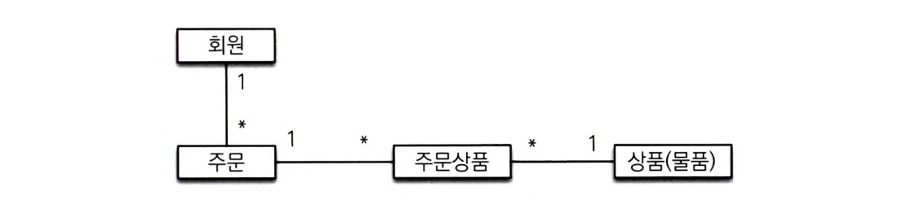
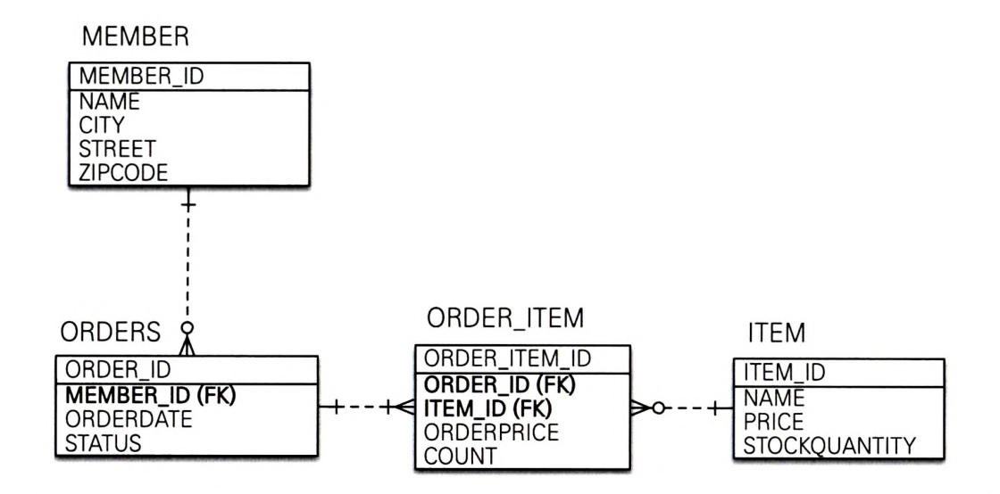
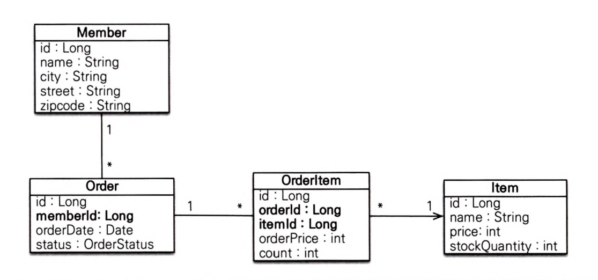

### 요구사항
- 회원은 상품을 주문할 수 있다.
- 주문 시 여러 종류의 상품을 선택할 수 있다.

- 회원 기능
  - 회원 등록
  - 회원 조회
- 상품 기능
  - 상품 등록
  - 상품 수정
  - 상품 조회
- 주문 기능
  - 상품 주문
  - 주문 내역 조회
  - 주문 취소

### 도메인 모델 분석

- 회원과 주문: 일대다
- 주문과 상품: 다대다 -> 다대다 관계는 일대다, 다대일 관계로 풀어서 설계

### 테이블 설계

- 회원 (MEMBER)
  - 이름
  - 주소
    - CITY
    - STREET
    - ZIPCODE
- 주문 (ORDERS)
  - MEMBER_ID를 외래 키로 가짐
  - 주문 날짜
  - 주문 상태
    - 주문 - ORDER
    - 취소 - CANCEL
- 주문 상품 (ORDER_ITEM)
  - 주문 ORDER_ID과 상품 ITEM_ID를 외래키로 가짐
  - 주문 금액
  - 주문 수량
- 상품
  - 이름
  - 가격
  - 재고수량
  - 상품을 주문하면 재고 수량이 줄어듬

### 엔티티 설계와 매핑

- ### [회원 엔티티](src/main/java/jpabook/model/entity/Member.java)
  - 기본 키 생성 전략 AUTO 
- ### [주문 엔티티](src/main/java/jpabook/model/entity/Order.java)
- ### [주문상품 엔티티](src/main/java/jpabook/model/entity/OrderItem.java)
- ### [상품 엔티티](src/main/java/jpabook/model/entity/Item.java)

### 데이터 중심 설계의 문제점
- 현재 방식은 테이블 설계에 맞춘 방법
- 외래 키를 갖고 있고 객체의 참조를 갖고 있지 않음
