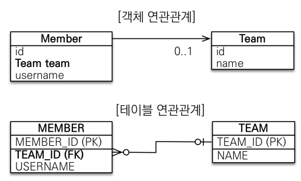
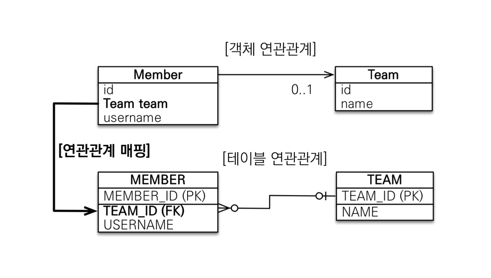
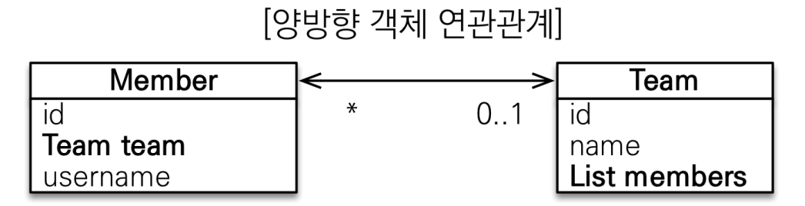

# 연관관계 매핑1

## 단방향 연관관계


### 객체 연관관계
- 회원 객체는 team 필드로 팀 객체와 연관관계를 맺음
- 회원 객체와 팀 객체는 단방향 관계 
  - 회원 객체는 team 필드를 통해서 팀 객체를 알 수 있음
  - 팀 객체는 회원 객체로 접근하는 필드가 없음 -> 팀 객체에서 회원 객체를 알 수 없음

### 테이블 연관관계
- 회원 테이블은 TEAM_ID 외래 키로 팀 테이블과 연관관계를 맺음
- 회원 테이블과 팀 테이블은 양방향 관계
  - TEAM_ID를 통해 회원과 팀, 팀과 회원으로 조인 가능

### 객체와 테이블 차이
**객체**
- 참조(객체)를 통해 연관관계를 맺음 
- 연관관계는 항상 단방향
  - 양방향 관계를 원한다면 두 객체 모두 참조 필드를 추가해야 함
  - 단방향 관계를 2개 설정하는 것과 같음
  ```java
  // 단방향
  class A {
    B b;
  }
  class B {}
  
  // 양방향
  class A {
    B b;
  }
  class B {
    A a;
  }
  ```
예시)
```java
public class Member {
    private String id;
    private String username;
    
    private Team team;
    
    public void setTeam(Team team) {
        this.team = team;
    }
}

public class Team {
    private String id;
    private String name;
}

// 동작 코드
private void main() {
    Member member1 = new Member("member1", "회원1");
    Member member2 = new Member("member2", "회원2");

    Team team1 = new Team("team1", "팀1");

    member1.setTeam(team1);
    member2.setTeam(team1);
    
    // 객체 그래프탐색 - 참조를 사용해서 연관관계를 탐색하는 것
    Team findTeam = member1.getTeam();
}
```
**테이블**
- 외래 키 하나로 양방향 관계를 가지며 연관관계를 탐색

```sql
SELECT *
FROM MEMBER M
JOIN TEAM T ON M.TEAM_ID = T.TEAM_ID

SELECT *
FROM TEAM T
JOIN MEMBER M ON T.TEAM_ID = M.TEAM_ID
```

### 객체 관계 매핑

```java
@Entity
public class Member {
    @Id @GeneratedValue
    @Column(name="MEMBER_ID")
    private Long id;

    @Column(name = "USERNAME")
    private String username;

    @ManyToOne
    @JoinColumn(name = "TEAM_ID")
    private Team team;
}

@Entity
public class Team {
    @Id @GeneratedValue
    @Column(name = "TEAM_ID")
    private Long id;
    private String name;
}
```
**@JoinColumn**
- name
  - 매핑할 외래 키 이름
  - 기본 값: 필드명 + _ + 참조 테이블의 기본 키 컬럼명
- referencedColumnName
  - 외래 키가 참조하는 대상 테이블의 컬럼명
  - 기본 값: 참조하는 테이블의 기본 키 컬럼명 
- foreignKey(DDL)
  - 외래 키 제약조건을 지정
  - 테이블 생성 시에만 사용

**@ManyToOne**
- optional
  - false로 설정 시 연관된 엔티티가 항상 있어야 함
  - 기본 값 true
- fetch
  - 글로벌 페치 전략 설정
  - 기본 값
    - ManyToOne = FetchType.EAGER
    - OneToMany = FetchType.LAZY
- cascade
  - 영속성 전이 기능을 사용
- targetEntity
  - 연관된 엔티티의 타입 정보 설정
  - 거의 사용하지 않음

## 연관관계 사용
### 저장
- 엔티티를 저장할 때 연관된 모든 엔티티는 영속 상태여야 한다
```java
public void testSave() {
//팀1 저장
Team team1 = new Team("team1", "팀 1");
em.persist(team1);

//회원1 저장
Member member1 = new Member("member1", "회원1");
//연관관계 설정 member1 -> team1
member1.setTeam(team1); 
em.persist(member1);

//회원2 저장
Member member2 = new Member("member2", "회원2");
//연관관계 설정 member2 -> team1
member2.setTeam(team1); 
em.persist(member2);

```

### 조회
**객체 그래프 탐색**
```java
Member member = em.find(Member.class, "member1");
// 객체 그래프 탐색
Team team = member.getTeam() ; 
```
**JPQL** 
- ':'로 시작하는 변수명 - 파라미터를 바인딩하는 문법
```java
// :teamName = 파라미터 바인딩
String jpql = "select m from Member m join m.team t where " +
          "t.name=:teamName";
```

### 수정
- update 메서드는 없음
- 트랜잭션을 커밋할 때 플러시에의해 변경 감지 기능으로 값을 업데이트
```java
//새로운 팀2
Team team2 = new Team("teaㅡ2", "팀2");
em.persist(team2);
//회원1에 새로운 팀2 설정

Member member = em.find(Member.class, "member1") ;
member.setTeam(team2);
```
### 연관관계 제거 및 삭제
```java
Member member1 = em.find(Member.class, "member1") ;
member1.setTeam(null); //연관관계 제거
em.remove(team) // 팀 삭제
```
## 양방향 연관관계

- 회원과 팀은 다대일 관계
- 팀과 회원은 일대다 관계
- 일대다는 여러 건의 연관관계를 맺을 수 있으므로 컬렉션 사용
  - 회원 -> 팀(Member.team)
  - 팀 -> 회원(Team.members) Team.members를 List로
```java
@Entity
public class Member {
  @Id
  @Column (name = "NEMBER_ID")
  private String id;
  private String username;
  
  @ManyToOne
  @JoinColumn(name="TEAM_ID")
  private Team team;
  //연관관계 설정
  public void setTeam(Team team) {
      this.team = team;
  }
}

@Entity
public class Team {
  @Id
  @Column(name = "TEAM_ID")
  private String id;
  private String name;
  
  @OneToMany (mappedBy = "team")
  private List<bfember> members = new ArrayList<Member>();
}

public void func() {
    Team team = em.find(Team.class, "team1");
    List<Member> members = team.getMembers(); //(팀 -> 회원)
  
    //객체 그래프 탐색
    for (Member member : members) {
        System.out.printin("member.username = " +
            member.getUsername());
    }    
}

```

## 연관관계 주인
- 두 연관관계 중 외래 키를 관리하는 필드
- 연관관계 주인만 DB와 매핑되어 외래 키를 관리(등록, 수정, 삭제)할 수 있음
- 주인이 아니면 읽기만 가능 
- mappedBy 속성으로 주인을 지정(주인은 사용X)
- **연관관계의 주인은 외래 키가 있는 곳으로**  

## 양방향 연관관계 저장
```java
//팀1 저장
Team team1 = new Team("team1", "팀 1");
em.persist(team1);

//회원1 저장
Member member1 = new Member("member1”, "회원1");
member1.setTeam(team1); //연관관계 설정 member1 -> team1
em.persist(member1);

// 회원2 저장
Member member2 = new Member ("member2", "회원2");
member2. setTeam (team1); //연관관계 설정 member2 -> team1
em.persist(member2);
```
- 양방향 연관관계는 주인이 외래 키를 관리
- 주인이 아닌 방향은 값을 설정하지 않아도 데이터베이스에 외래 키 값이 정상 입력 된다

```java
// 무시(연관관계의 주인이 아님)
team1.getMembers().add(member1);
team1.getMembers().add(member2);
```
- 주인이 아닌 곳에 입력된 값은 외래 키에 영향을 주지 않음(DB 저장 시 무시)

## 양방향 연관관계 주의점
### 주인이 아닌 곳에만 값 입력
- 연관관계의 주인이 아닌 곳에만 값을 저장하는 경우 외래 키는 null로 저장된다
```java
// 회원1 저장
Member member1 = new Member("member1", "회원1");
em.persist(member1);

// 회원2 저장
Member member2 = new Member("member2", "회원2");
em.persist(member2);

Team team1 = new Team("team1", "팀 1");

// 주인이 아닌 곳만 연관관계 설정
// Member 테이블에 TEAM_ID(외래 키)는 null로 저장된다
team1.getMembers().add(member1);
team1.getMembers().add(member2);
em.persist(team1);
```
### (권장) 양쪽 모두 값 입력 
```java
Team team1 = new Team("team1", "팀 1");
em.persist(team1);

Member member1 = new Member("member1", "회원1");

// 양방향 연관관계 설정
member1.setTeam(team1);
team1.getMembers().add(member1);
em.persist(member1);

Member member2 = new Member("member2", "회원2");

// 양방향 연관관계 설정
member2.setTeam(team1);
team1.getMembers().add(member2);
em.persist(member2);
```

### 연관관계 편의 메서드
- 하나의 메서드로 양방향 연관관계 설정
```java
public class Member {
    private Team team;

    // 편의 메서드
    public void setTeam(Team team) {
        this.team = team;
        team.getMembers().add(this);
    }
}

public void testORM_양방향_리팩토링() {
  Team team1 = new Team("team1", "팀1");
  em.persist(team1);
  
  Member member1 = new Member("member 1", "회원");

  // 기존 양방향 설정
  // member1.setTeam(team1);
  // team1.getMembers().add(member1);
  
  // 편의 메서드 양방향 설정
  member1.setTeam(team1); 
  
  em.persist(member1);
}
```
### 편의 메소드 작성 시 주의사항
- 기존 양방향 연관관계가 있으면 기존 관계를 삭제해야 함
```java
public void setTeam(Team team) {
    // 기존 관계 제거
    if (this.team != null) {
        this.team.getMembers().remove(this);
    }
    
    this.team = team;
    team.getMembers().add(this);
}
```
