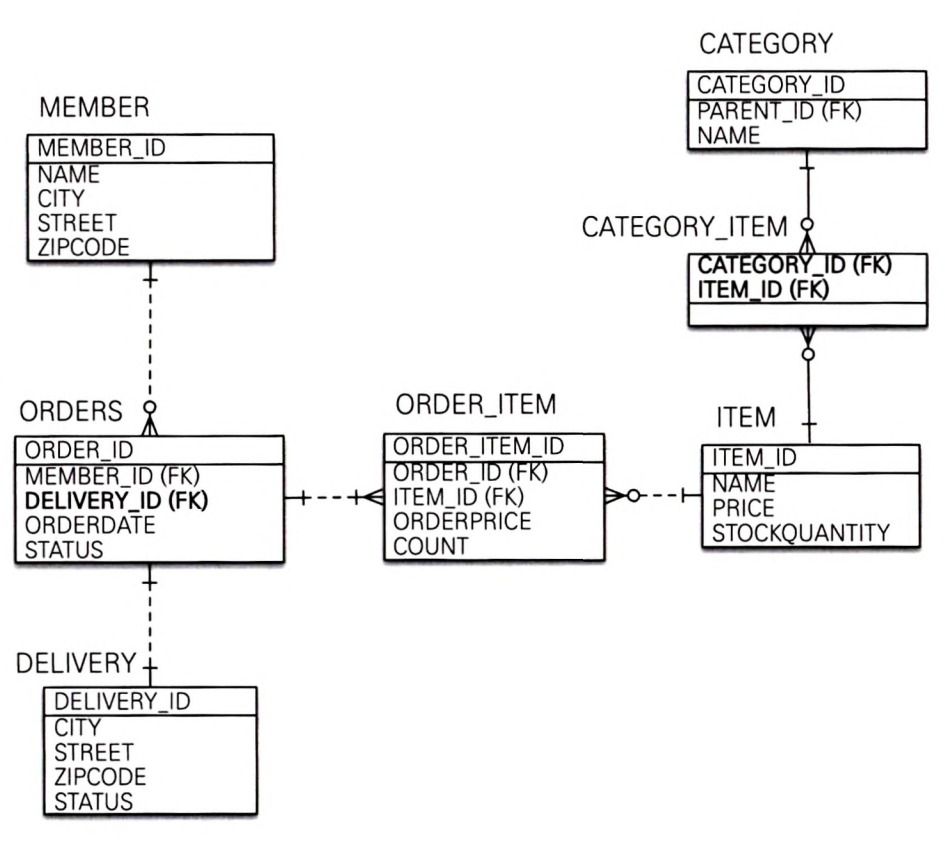

## 요구사항 추가
- 상품 주문 시 배송 정보 입력
- 상품을 카테고리로 구분

- 주문과 배송
  - 일대일 관계
- 상품과 카테고리
  - 다대다 관계 
  - 연결 테이블 CATEGORY_ITEM 추가 -> 일대다, 다대일 관계로

### [주문 엔티티](src/main/java/jpabook/model/entity/Order.java)
### [배송 엔티티](src/main/java/jpabook/model/entity/Delivery.java)
- 주문과 배송은 일대일 관계
- 주문에 외래 키 설정(연관관계 주인)

### [카테고리 엔티티](src/main/java/jpabook/model/entity/Category.java)
### [상품 엔티티](src/main/java/jpabook/model/entity/Item.java)
- 상품과 카테고리는 다대다
- Category가 연관관계 주인
- CategoryItem 연결 엔티티를 만들어서 일대다, 다대일로 매핑하는 것을 권장

