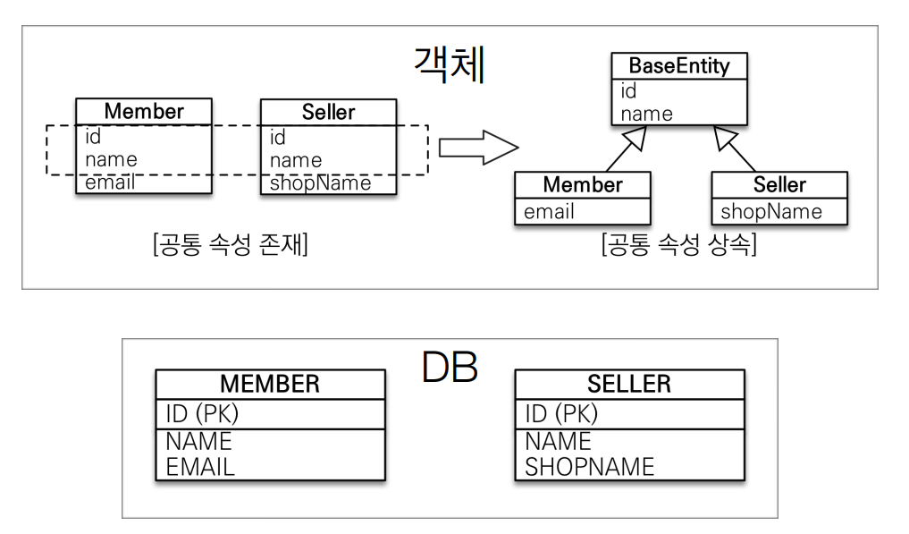

# 고급매핑

## 상속 관계 매핑
DB의 슈퍼타입 서브타입 관계를 매핑하는 것

### 조인 전략
- 엔티티를 모두 테이블로 만들고 조회할 때 조인 사용
- 자식 테이블이 부모 테이블의 기본 키를 받아 기본 키 + 외래 키로 사용
- 타입을 구분하는 컬럼 필요

```java
@Entity
@Inheritance(strategy = InheritanceType.JOINED)
@DiscriminatorColumn(name = "DTYPE")
public abstract class Item {
    @Id
    @GeneratedValue
    @Column(name = "ITEM_ID")
    private Long id;
    private String name;
    private int price;
}

@Entity
@DiscriminatorValue("A")
public class Album extends Item {}

@Entity
@DiscriminatorValue("M")
public class Movie extends Item {}
```
- @Inheritance(strategy = InheritanceType.JOINED)
  - 상속 매핑은 부모 클래스에 @Inheritance를 사용
- @DiscriminatorColumn(name = "DTYPE")
  - 자식 테이블을 구분하기 위한 컬럼을 지정하는 속성
  - 기본값 DTYPE
    - @DiscriminatorColumn(name = "DTYPE") = @DiscriminatorColumn
- @DiscriminatorValue("M")
  - 구분 컬럼에 입력할 값
- @PrimaryKeyJoinColumn
  - 자식 테이블은 부모 테이블의 ID 컬럼명을 기본값으로 사용
  - ID 컬럼을 변경하고 싶을 때 사용
```java
@Entity
@DiscriminatorValue("B")
@PrimaryKeyJoinColumn(name = "BOOK_ID") // ID 재정의
public class Book extends Item {}
```

**장점**
- 정규화 된 테이블
- 외래 키 참조 무결성 제약조건 활용 가능
- 효율적인 저장공간 사용

**단점**
- 많은 조인 사용으로 성능 저하가 있을 수 있음
- 조회 쿼리가 복잡
- 데이터 등록 시 INSERT 두 번 실행

### 단일 테이블 전략
- 테이블을 하나만 사용해서 통합
- 조회할 때 조인을 사용하지 않음
- 자식 엔티티의 매핑 컬럼은 모두 null을 허용 해야함
```java
@Entity
@Inheritance(strategy = InheritanceType.SINGLE_TABLE)
@DiscriminatorColumn(name = "DTYPE")
public abstract class Item {
    @Id
    @GeneratedValue
    @Column(name = "ITEM_ID")
    private Long id;
}
```
**장점**
- 조인이 없어 조회가 빠름
- 조회 쿼리가 단순

**단점**
- 자식 엔티티의 매핑 컬럼에 null 허용
- 테이블이 커질 수 있고 상황에 따라 조회 성능이 느려질 수 있음

### 구현 클래스 테이블 전략
- 서브 타입마다 하나의 테이블을 만든다
- 권장하지 않음
- 구분 컬럼을 사용 안함
```java
@Entity
@Inheritance(strategy = InheritanceType.TABLE_PER_CLASS)
public abstract class Item {
    @Id
    @GeneratedValue
    @Column(name = "ITEM_ID")
    private Long id;
}
```
**장점**
- 서브 타입을 구분해서 처리할 때 효과적
- not null 제약조건 사용 가능

**단점**
- 자식 테이블을 함께 조회할 때 성능이 안 좋음
- 자식 테이블 통합 쿼리가 어려움

## @MappedSuperclass
- 부모 클래스는 테이블과 매핑하지 않고 자식 클래스에게 매핑 정보만 제공할 때 사용
- 직접 생성해서 사용할 일이 없으므로 **추상 클래스로 만드는 것을 권장**
- 엔티티가 공통으로 사용하는 매핑 정보를 모으는 역할(등록일, 수정일 등)



```java
@MappedSuperclass
public abstract class BaseEntity {
    @Id @GeneratedValue
    private Long id;
    private String name;
}
@Entity
public class Member extends BaseEntity {
    // ID, NAME 상속
    private String email;
}
@Entity
public class Seller extends BaseEntity {
    // ID, NAME 상속
    private String shopName;
}
```
- @AttributeOverrides, @AttributeOverride
  - 매핑 정보를 재정의할 때 사용
```java
@Entity
// id 속성을 MEMBER_ID로 재정의
@AttributeOverride(name = "id", column = @Colunm (name = "MEMBER_ID"))
public class Member extends BaseEntity { ... }

@Entity
// 두 개 이상의 속성을 재정의
@AttributeOverrides({
        @AttributeOverride (name = "id", column = @Column (name = "MEMBER_ID")),
        @AttributeOverride (name = "name", column = @Column (name = "MEMBER_NAME"))
})
public class Member extends BaseEntity { ... }

```
- @AssociationOverrides, @AssociationOverride
  - 연관관계를 재정의할 때 사용
