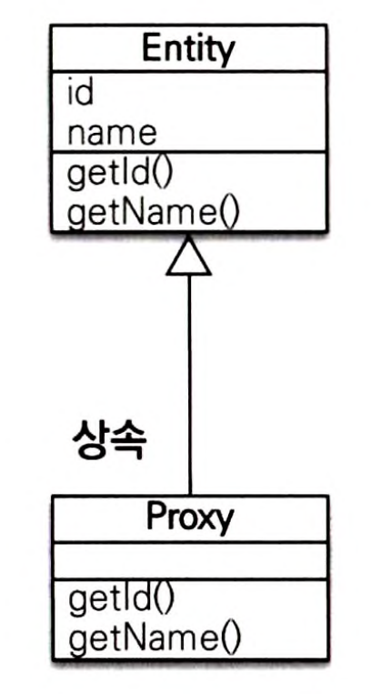
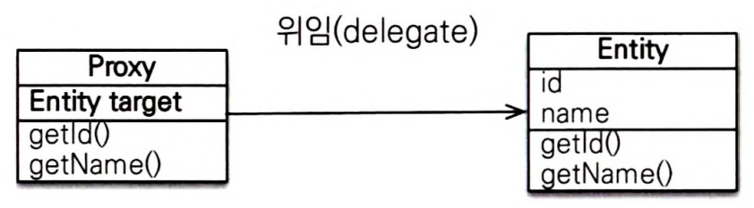
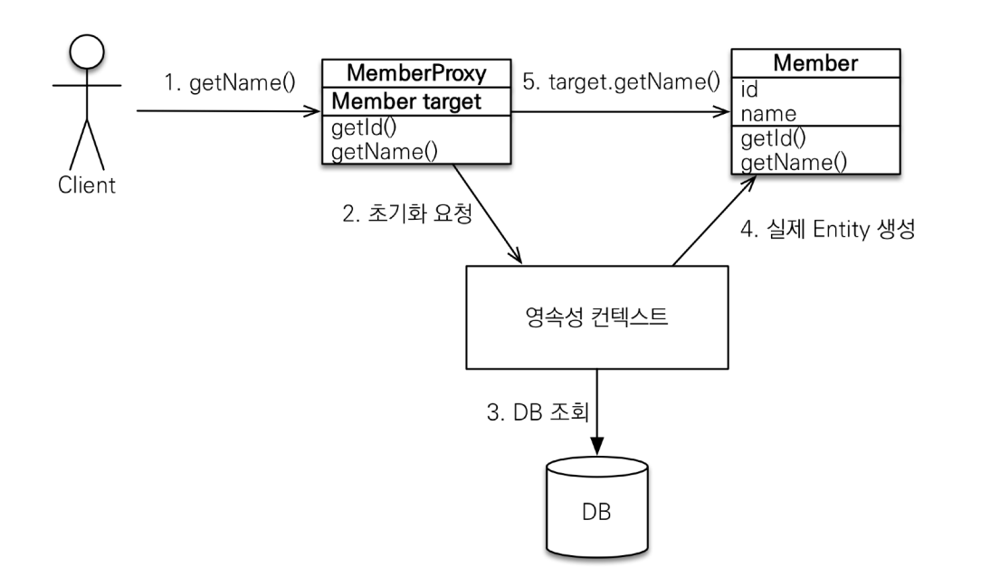

## 프록시
- 엔터티를 조회할 때 연관된 엔티티들이 항상 사용되는 것은 아님

```java
// 회원과 팀 정보 출력
public void printUserAndTeam(String memberId) {
    Member member = em.find(Member.class, memberId);
    Team team = member.getTeam();
    System.out.println("회원 이름 : " + member.getUsername());
    System.out.println("소속팀 : " + team.getName());
}

// 회원만 출력
public String printUser(String memberId) {
    Member member = em.find(Member.class, memberId);
    System.out.println("회원 이름 : " + member.getUsername());
}
```
**printUser()**
- 메서드는 회원 정보만 출력
- DB 조회 시 회원 정보만 조회하는 것이 효율적
- 팀 엔티티는 실제 값을 사용하는 시점에 DB에서 조회하는 것이 효율적

**지연로딩**
- 엔티티를 실제 사용하는 시점에 DB에서 조회

**프록시 객체**
- 지연 로딩을 사용 시 실제 엔티티 객체 대신 DB 조회를 지연할 수 있는 가짜 객체

### 프록시 기초
**entityManager.find()**

- 데이터베이스를 통해 **실제 엔티티 객체 조회**
- 연관 테이블의 사용 여부에 관계없이 JOIN 해서 데이터를 가져온다. → 성능 저하

**entityManager.getReference()**

- 데이터베이스를 조회하지 않고 실제 엔티티 객체도 생성하지 않는다
- 대신 데이터베이스 접근을 위임한 프록시 객체를 반환

**프록시 객체**



- 프록시 클래스는 실제 클래스를 상속 받아서 만들어짐
- 프록시 객체는 실제 객체에 대한 참조를 보관
- 프록시 객체의 메서드를 호출하면 실제 객체의 메서드를 호출



** 프록시 객체의 초기화 **
- 프록시 객체는 실제 사용될 때 DB에서 조회해서 엔티티 객체를 생성 

```java
// 프록시 초기화
// MemberProxy 반환
Member member = em.getReference(Member.class, "id1");
member.getName();

// 프록시 클래스 예상
class MemberProxy extends Member {
    Member target = null;
    
    public String getName() {
        if  (target == null) {
            // 초기화 요청
            // DB 조회
            // 실제 엔티티 생성 및 참조 보관
            this.target = ...;
        }
        
        return target.getName();
    }
}
```



**프록시 특징**
- 프록시 객체는 처음 사용시 한 번만 초기화 된다
- 프록시 객체를 초기화 해도 실제 엔티티로 바뀌진 않음
  - 프록시 객체를 통해 실제 엔티티에 접근
- 프록시 객체는 엔티티를 상송받은 객체, 타입 체크 시 주의
  - instance of 사용
- 영속성 컨텍스트에 엔티티가 이미 있으면 DB 조회가 필요 없음
  - getReference()를 호출해도 실제 엔티티를 반환
- 준영속 상태의 프록시를 초기화 하면 예외 발생

## 즉시 로딩, 지연 로딩

### 즉시 로딩
- 엔티티 조회 시 연관 엔티티도 함께 조회
- 최적화를 위해 가능하면 조인 쿼리가 사용된다
  - 기본적으로(null 허용) outer join을 사용
  - nullable 속성을 false로 주면 내부 조인을 사용
  - @ManyToOne.optional = false로 설정해도 내부 조인 사용
```java
public class Member {
    @ManyToOne(fetch = FetchType.EAGER)
    @JoinColumn(name = "TEAM_ID")
    private Team team;
}
```

### 지연 로딩
- 연관객체는 프록시 객체로 초기화 되며 실제 사용 시점에 DB에서 조회한다

```java
public class Member {
    @ManyToOne(fetch = FetchType.LAZY)
    @JoinColumn(name = "TEAM_ID")
    private Team team;
}
```

### JPA 기본 패치 전략
- `@ManyToOne`, `@OneToOne` : 즉시 로딩(`FetchType.EAGER`)
- `@OneToMany`, `@ManyToMany` : 지연 로딩(`FetchType.LAZY`)
- 연관된 엔티티가 하나면 즉시 로딩을, 컬렉션이면 지연 로딩을 사용
- 모든 관계에 지연 로딩 사용을 권장

## 영속성 전이: CASCADE
엔티티를 영속 상태로 만들 때 연관 엔티티도 영속 상태로 만드는 기능

**부모가 여러 자식 엔티티를 가지고 있을 때**
```java
@Entity
public class Parent {

    @Id @GeneratedValue
    private Long id;
    
    @OneToMany(mappedBy = "parent")
    private List<Child> children = new ArrayList<Child>();
}

@Entity
public class Child {

    @Id @GeneratedValue
    private Long id;
    
    @ManyToOne
    private Parent parent;
}

private static void saveNoCascade(EntityManager em) {
    // 부모 저장
    Parent parent = new Parent();
    em.persist(parent);
    
    // 1번 자식 저장
    Child child1 = new Child();
    child1.setParent(parent);          // 자식 -> 부모 연관관계 설정
    parent.getChildren().add(child1);  // 부모 -> 자식
    em.persist(child1);
    
    // 2번 자식 저장
    Child child2 = new Child();
    child2.setParent(parent);          // 자식 -> 부모 연관관계 설정
    parent.getChildren().add(child2);  // 부모 -> 자식
    em.persist(child2);
}
```
- JPA에서 엔티티를 저장할 때 연관된 모든 엔티티는 영속 상태여야 한다.

### 영속성 전이: 저장
```java
@Entity
public class Parent {
    // CASCADE 옵션 영속성 전이 활성화
    @OneToMany(mappedBy = "parent", cascade = CascadeType.PERSIST)
    private List<Child> children = new ArrayList<Child>();
}

// 영속성 전이 저장 코드
{
Child child1 = new Child();
Child child2 = new Child();

Parent parent = new Parent();
    child1.setParent(parent);         // 연관관계 추가
    child2.setParent(parent);         // 연관관계 추가
    parent.getChildren().add(child1);
    parent.getChildren().add(child2);

// 부모 저장, 연관된 자식들 저장
    em.persist(parent);
}
```
### 영속성 전이: 삭제
```java
// 영속성 전이 X
Parent findParent = em.find(Parent.class, 1L);
Child findChild1 = em.find(Child.class, 1L);
Child findChild2 = em.find(Child.class, 2L);

em.remove(findChild1);
em.remove(findChild2);
em.remove(fineParent);

// 영속성 전이
@OneToMany(mappedBy = "parent", cascade = CascadeType.REMOVE)
private List<Child> children = new ArrayList<Child>();
{
    Parent findParent = em.find(Parent.class, 1L);
	em.remove(findParent);
}
```
- 부모 엔티티만 삭제하면 연관된 자식 엔티티도 함께 삭제
- 외래 키 제약조건을 고려해서 자식을 먼저 삭제하고 부모를 삭제

```java
// 여러 속성 같이 사용 가능
cascade = {CascadeType.PERSIST, CascadeType.REMOVE}
```

## 고아 객체
- 고아 객체 제거: 부모 엔티티와 연관관계가 끊어진 자식 엔티티를 자동으로 삭제
- 플러시 시점에 적용
- 참조하는 곳이 하나일 때만 사용
  - `@OneToOne`, `@OneToMany`만 사용 가능
- 부모를 제거하면 자식도 같이 제거, CascadeType.REMOVE와 같음
```java
@Entity
public class Parent {

    @Id @GeneratedValue
    private Long id;
    
    // orphanRemoval = true
    @OneToMany(mappedBy = "parent",cascade = CascadeType.ALL, orphanRemoval = true)
    private List<Child> childList = new ArrayList<>();
}

{
		Child child1 = new Child();
		Child child2 = new Child();
		
		Parent parent = new Parent();
		parent.addChild(child1);
		parent.addChild(child2);
		
		em.persist(parent);
		
		em.flush();
		em.clear();
		
		Parent findParent = em.find(Parent.class, parent.getId());
		
		// child에서 0번째 인덱스 삭제
		// 자식 엔티티를 컬렉션에서 제거
		// 데이터베이스의 데이터도 삭제된다.
		findParent.getChildList().remove(0);   
}
```
### 생명주기

**CasecadeType.ALL + orphanRemoval = true를 동시 사용**
- 엔티티 스스로 생명주기를 관리
  - 부모 엔티티를 통해서 자식의 생명주기를 관리할 수 있다
  - 자식 엔티티는 DAO가 없어도 됨
- 도메인 주도 설계(`DDD`)의 `Aggregate Root`개념을 구현할 때 유용

**자식을 저장하려면 부모에 등록만 하면 된다. (CASCADE)**

```java
Parent parent = em.find(Parent.class, parentId);
parent.addChild(child1);
```

**자식을 삭제하려면 부모에서 제거하면 된다(orphanRemoval)**

```java
Parent parent = em.find(Parent.class, parentId);
parent.getChildren().remove(removeObject);
```

